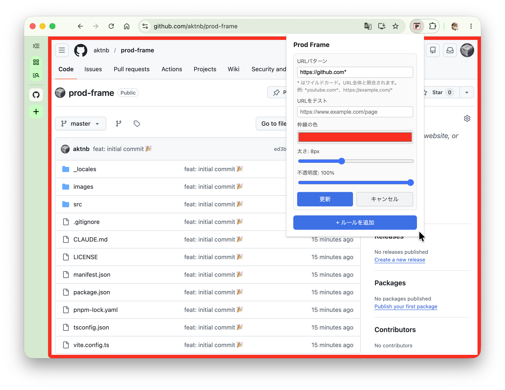

# Prod Frame

URLパターンにマッチしたWebページに枠線を表示するChrome拡張機能。本番環境と検証環境の取り違えを防ぐ。

## スクリーンショット



## 機能

- URLパターン（グロブ形式）を登録し、マッチしたページに枠線を表示
- 枠線の色・太さ・不透明度を自由に設定
- ルールごとの有効/無効切り替え
- SPA対応（`popstate` + `MutationObserver` でURLの変化を検知）
- ルール変更をリアルタイム反映（ページリロード不要）

## 開発

```bash
pnpm dev        # ウォッチモードでビルド（ファイル変更を自動検知）
pnpm build      # プロダクションビルド → dist/
pnpm typecheck  # 型チェック（noEmit）
```

`pnpm dev` 実行中は、ソースを変更するとすぐに `dist/` が更新される。Chrome の拡張機能管理画面で「更新」ボタンを押すと最新のビルドが反映される。

## 使い方

1. ツールバーの Prod Frame アイコンをクリックしてポップアップを開く
2. URLパターン（例: `https://example.com/*`）と枠線スタイルを設定してルールを追加
3. マッチするページを開くと枠線が表示される

### URLパターン

グロブ形式で指定する。`*` は任意の文字列にマッチする。

| パターン | マッチ例 |
|---|---|
| `https://example.com/*` | `https://example.com/any/path` |
| `https://*.example.com/*` | `https://staging.example.com/` |
| `https://example.com/admin*` | `https://example.com/admin/users` |

## 技術スタック

- TypeScript (strict mode)
- React 18
- Vite + @crxjs/vite-plugin
- Chrome Extension Manifest V3

## ライセンス

[LICENSE](LICENSE) を参照。
